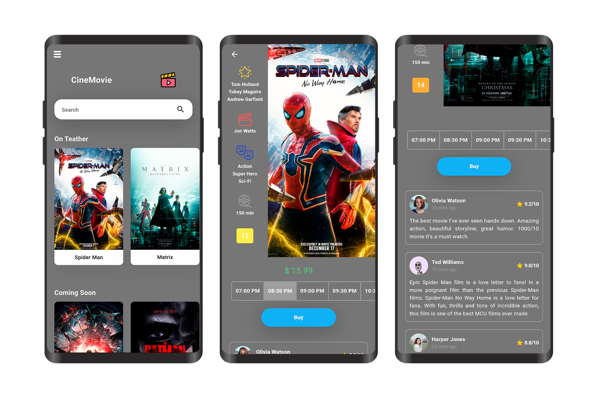

 🎬 Movie App

Cine Movie App is a modern movie and cinema mobile application UI built using Flutter.  
The app provides a clean and engaging interface for browsing movies, viewing movie details, exploring showtimes, and reading user reviews.

The project focuses on creating a smooth and visually appealing cinema experience with a responsive and intuitive Flutter UI.

---

 📝 About the App

Cine Movie App is a UI-focused Flutter project designed to showcase a modern cinema and movie-ticketing interface.

Users can browse currently showing and upcoming movies, search for movies, view movie details, explore available showtimes, and read movie reviews through a clean and user-friendly interface.

The app includes:

- 🎬 Movie browsing
- 🔍 Movie search
- 🕐 Showtimes
- ⭐ Movie ratings and reviews
- 🎭 Movie details and genres
- 🎟️ Ticket purchase interface

The project focuses on Flutter UI development and user experience without backend or real payment functionality.

---

 🚀 Features

- 🏠 Home: Displays currently showing and upcoming movies in an attractive layout.
- 🔍 Movie Search: Search interface for finding movies.
- 🎬 Movie Details: View movie posters, cast, director, genres, duration, and rating.
- 🎭 Movie Information: Displays movie categories such as Action, Super Hero, and Sci-Fi.
- 🕐 Showtimes: Displays available cinema showtimes for selected movies.
- 🎟️ Ticket Purchase UI: Provides a user interface for selecting a showtime and purchasing a ticket.
- ⭐ Movie Ratings: Displays movie ratings and user scores.
- 💬 Reviews: Displays user comments and movie reviews.
- 🖼️ Movie Posters: Presents movies using visually appealing poster cards.
- 📱 Responsive UI: Designed with a clean and user-friendly mobile interface.

---

 📱 App Screenshots

  

---

🧰 Installation

Before running the project, make sure you have the following installed:

- ✅ Flutter SDK
- ✅ Android Studio or Visual Studio Code
- ✅ Emulator or physical Android/iOS device

---

